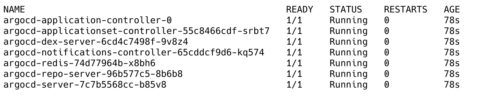

  <p align="center"></p>
  <h1 align="center" style="color: #0074D9;">Team Tertius</h1>

### Full Stack Web App Project
This project implements a user authentication system comprising a login page, signup page, and a dashboard control panel. It utilizes Amazon Elastic Kubernetes Service (EKS) to host a React-based front-end application and a Java-based backend API. The backend API interacts with a PostgreSQL database, implemented in Amazon Relational Database Service (RDS) to manage user information securely.

## Table of Contents

1. [Installation](#installation)
2. [Amazon Web Services](#amazon-web-services)
3. [Database](#database)
4. [Front-end React App](#front-end-React-App)
5. [Back-end Java API](#back-end-Java-API)
6. [Endpoints](#endpoints)
7. [Authentication](#authentication)
8. [Deployment](#deployment)
9. [Folder Structure](#folder-structure)
9. [Troubleshooting](#troubleshooting)


# Installation

Below steps are required in order to use this Infrastructure as Code (IaC) Project:
1. [Clone the repository](#clonerepo)
1. [Login to AWS Account](#loginaws)
1. [Provision Terraform Config](#provisionterraform)
1. [Build and Integrate Docker images](#baidocker)
1. [Apply Kubernetes Config](#k8sconfig)

Optional:
- [Set up CI pipeline using CircleCI](#optional-set-up-ci-pipeline-using-circleci)
- [Set up CD Pipeline using ArgoCD](#optional-set-up-cd-pipeline-using-argocd)
- [Set up Logging using Prometheus and Grafana](#optional-set-up-logging-using-prometheus-and-grafana)


### <a id="clonerepo">Clone the repository</a>
Clone the repository and `cd` into it using:
```
git clone https://github.com/footedroom575/ce-team-project.git && cd ce-team-project
```
### <a id="loginaws">Login to AWS Account</a>
Use Short Term Credentials (STC) or login using below command:

```
aws configure
```

More details [here](https://docs.aws.amazon.com/cli/latest/userguide/cli-chap-authentication.html).

Verify you're logged in using:
```
aws sts get-caller-identity
```
Above command should return a JSON object including you account details.

### <a id="provisionterraform">Provision Terraform Config</a>
Once logged in, you need to provision terraform config in your AWS account. First, initialize terraform in `terraform` directory. Use below commands in order:
```
cd terraform
```

Now, we need to run below which is going to setup AWS provider config and modules:
```
terraform init
```

More details on above command [here](https://developer.hashicorp.com/terraform/cli/commands/init).

Once the initialization is done, you can simply run:

```
terraform apply
```

which is going to provision all resources required for this full stack application to work (i.e. database, eks cluster, etc). It will also ask for some input values for variables (for security reasons) from terminal such as `db_name`, `db_user` & `db_password`. These values are not a part of `terraform.tfvars`.

<b>P.s. The above command might take around 25-35 mins to complete as AWS is provisioning an RDS instace and EKS.</b>

### <a id="baidocker">Build and Integrate Docker images</a>
Once the infrastructure is deployed, we can now use the `db_dns_address` from outputs and use it to build our backend application. You can use this [FE Dockerfile](https://github.com/footedroom575/ce-team-project-frontend/blob/main/Dockerfile) and [BE Dockerfile](https://github.com/footedroom575/ce-team-project-backend/blob/main/Dockerfile) to build the frontend and backend. Example usage shown below:

<b>For Frontend</b>:
```
docker build --build-arg VITE_API_BASE_URL="http://ingress-link/be" -t ce-fe:1.0 .
```
You'll need to get ingress link from after Kubernetes config and supply it to above command. 

<b>For Backend</b>:
```
docker build --no-cache --build-arg DATABASE_URL="postgresql://rds_dns_address:5432/customer" --build-arg DB_USERNAME="username" --build-arg DB_PASSWORD="password" -t ce-be:1.0 .
```

Change the commands as per your requirements.

After building these images, you need to push them to any Docker image registry like Amazon ECR, Dockerhub, etc. (you'll need the image in next step)

### <a id="k8sconfig">Apply Kubernetes Config</a>
Now, once the basic ingrastructure is deployed, we need to set up deployments and services for frontend and backend and set up an ingress so we can make sure the app is publicly accessible and functioning properly.

First off, you'll need to switch your kubernetes context to point it towards your EKS cluster. For that, use below command in `terraform` directory:

```
aws eks --region $(terraform output -raw region) update-kubeconfig --name $(terraform output -raw cluster_name)
```

After switching context to your EKS cluster, we can apply the k8s config from `kubernetes` directory using below set of commands:

```
# For setting up Nginx Ingress Controller
kubectl apply -f deploy.yaml

# wait for controller to be accessible
kubectl wait --namespace ingress-nginx  --for=condition=ready pod --selector=app.kubernetes.io/component=controller --timeout=120s


# once above command is done, we can deploy our ingress and rest of config using
kubectl apply -f "*.yaml*"

# just make sure to change image names to so the FE and BE Deployments use your image, otherwise you wont be able to access the application.
# For Ingress DNS you need to use AWS Management console and look for 'Load Balancers' and copy the DNS of ingress to use during docker image building
```


### (Optional) Set up CI pipeline using CircleCI

In CircleCI you define your pipeline using a YAML file called `config.yml` and it should be placed within the `.circleci` directory.We’ve already set you up with a starter config file that will build the application and then run the tests you can explore the file
within the `.circleci` directory [here](https://github.com/footedroom575/ce-team-project-backend/blob/main/.circleci/config.yml). 

Go through comments in `config.yml` and modify it as per your needs.

### (Optional) Set up CD Pipeline using ArgoCD

After your infrastructure is deployed, you can setup a CD pipeline using ArgoCD and use it to automate Deployments.

#### Installing ArgoCD 

To do this firstly create a separate Kubernetes namespace for ArgoCD

```
kubectl create namespace argocd
```
Then apply the YAML files associated with Argo. The command below just applies a YAML file called install.yaml that contains
all the various services, deployments for ArgoCD. 
```
kubectl apply -n argocd -f https://raw.githubusercontent.com/argoproj/argo-cd/stable/manifests/install.yaml
```
You can see if your ArgoCD pods deployed by running: 
```
kubectl get pods -n argocd
```
And you should see something similar to: 


#### Obtaining the ArgoCD password 
To log in to the ArgoCD user interface you will need to obtain the password. 

Run the following command to obtain your admin password, once all of your pods are ready and running: 
🗒️ NOTE: If the password is printed with a percent (%) sign you can ignore this character. The percent just indicates the end of
line 
```
kubectl -n argocd get secret argocd-initial-admin-secret -o jsonpath="{.data.password}" | base64 -d
```
Take note of this password, you will use it shortly 
Port forwarding to access ArgoCD 
Now you will use Kubernetes port forwarding to access the user interface 
```
kubectl port-forward svc/argocd-server -n argocd 8080:443
```

Logging into ArgoCD 
Now open up your browser and navigate to `http://localhost:8080` 
Your browser will warn you about the certificate, choose Advanced and Proceed anyway 
You should then see the ArgoCD log in page 
Enter the username admin 
Enter the password received in the previous step and log in

### (Optional) Set up Logging using Prometheus and Grafana

Deploy this kube-prometheus-stack Helm chart using ArgoCD into your cluster.

The following options will enable Prometheus to work better on a EKS:

In <b>General</b> > <b>Sync Options</b>, enable <b>Server Side Apply</b>.

In <b>Source</b> > <b>Repository URL</b>, use https://prometheus-community.github.io/helm-charts and select <b>Helm Chart</b> rather than GIT.

In <b>Source</b> > <b>Chart</b>, select <b>kube-prometheus-stack</b> and choose version `48.6.0`.

In Values, you need to set the following options:

- `nodeExporter.enabled` as `false`
- `prometheus.prometheusSpec.podMonitorSelectorNilUsesHelmValues` as `false`
- `prometheus.prometheusSpec.serviceMonitorSelectorNilUsesHelmValues` as `false`

Select <b>Create</b>, and then <b>Sync</b> your Prometheus app in the ArgoCD dashboard.

Note: You might have to sync twice due to a bug, but once your status reads Healthy, it's fine.

Check that you can see the <b>prometheus-operated</b> and connect to this using port forwarding:

```
kubectl port-forward svc/prometheus-operated 9090:9090
```

Then, connect to `localhost:9090` in your browser. If all has gone well, you should be met with the Prometheus UI. 

For Grafana, you need to port-forward it as well. You can use:
```
kubectl port-forward svc/prometheus-grafana 9091:9091
```

And you should be able to access it on `localhost:9091`. Use below (default) credentials for logging into Grafana:

```
Username: admin
Password: prom-operator
```

More infomation on Prometheus [here](https://prometheus.io/docs/introduction/overview/)

More infomation on Grafana [here](https://grafana.com/docs/)


# Amazon Web Services

### Components
- vpc
- subnet - public x3
- subnet - private x3
- route table - public
- route table - private
- internet gateway
- nat gateway

### Layout


### tfvars

End-user provides terraform.tfvars file with desired config

- region - region to deploy in
- vpc_name - naming vpc and in the naming convention for vpc components
- vpc_cidr - assigning a cidr block to the vpc
- public_subnets - creating public subnets each with a cidr block from the given list 
- private_subnets - creating private subnets each with a cidr block from the given list 
- availability_zones - assigning components to availability zones

### Tags

#### ManagedBy
Every component (wherever possible) is tagged with:

    ManagedBy = "Terraform"  

This is to reinforce at console management that the component should only be managed via terraform.

#### Name
Every component (wherever possible) is named with the prefix of the vpc_name variable  
e.g. "${vpc_name}-eu-west-2a-public-subnet

#### EKS
The public subnets are tagged with:

    "kubernetes.io/cluster/${var.cluster_name}" = "shared"
    "kubernetes.io/role/internal-elb"           = 1

The private subnets are tagged with:

    "kubernetes.io/cluster/${var.cluster_name}" = "shared"
    "kubernetes.io/role/elb"                    = 1

This is to indentify the placement of the elb & internal-elb for the EKS.  

### requirements

Terraform EKS module version: 19.15.2  
Terraform VPC module version: 5.0.0  
AWS EKS cluster_version = 1.27

[[ Back to top ]](#)


# Database

Backend postgres RDS database

### Requirements
- VPC
- subnet
- security group, to allow ingress on 5432

### Exposed endpoints

- health
- info 
- prometheus

### Terraform database module

variables
- db_name: defaults to "main"
- db_username: to create postgres RDS database user, don't use "user" or "admin" as they are reserved words in postgres
- db_password: to create postgres RDS database password, has minimum requirements
- db_subnets: list of subnets to create RDS database in, public / private, dedicated subnet?, availiability zone?
- az: availability zone for postgres database RDS
- db_security_group_ids - list of security groups for ingress to postgres database RDS on port 5432

outputs  
- db_dns_address - DNS address assigned when RDS database is created

### SQL commands Files

creates customer table

    CREATE TABLE customer (
        id SERIAL PRIMARY KEY,
        name TEXT NOT NULL,
        email TEXT NOT NULL,
        password TEXT NOT NULL,
        age INT NOT NULL
    );

adds unique constraint to profile_image_id, the id used to create unique customer images for each customer entry

    ALTER TABLE customer
    ADD COLUMN profile_image_id VARCHAR(36);

    ALTER TABLE customer
    ADD CONSTRAINT profile_image_id_unique UNIQUE (profile_image_id);

[[ Back to top ]](#)

# Front-end React App

App provides a front-end user authentication system comprising a login page, signup page, and a dashboard control.


### Build Environment

- node:20.10.0  
- nginx:1.21.0-alpine  

### Libraries, Frameworks, or Utilities

- ChakraUI
- Formik
- Yup
- Axios

### Environment Variables

.env Environment variables file, located in the root of the repository
setting the variable VITE_API_BASE_URL, 

[[ Back to top ]](#)

# Back-end Java API

This API provides user login authentication and storage functionality using Java Spring Boot and PostgreSQL.

### Build Environment

- eclipse-temurin:17-jre-jammy
- maven:3-amazoncorretto-20  

### Configuration files

The backend java API uses yaml config files to connect to a database.  
currently this is a H2 in-memory database.  
this is a sample yaml config file for connecting to a postgres database.  
need to replace:
- URL: URL of postgres database
- USERNAME: username of database user, don't use "user" or "admin" as they are reserved words in postgres
- PASSWORD: password of database user


        server:
        port: 8080
        error:
            include-message: always

        cors:
        allowed-origins: "*"
        allowed-methods: "*"
        allowed-headers: "*"
        exposed-headers: "*"

        management:
        endpoints:
            web:
            exposure:
                include: "health,info,prometheus"

        spring:
        datasource:
            url: jdbc:postgresql://URL:5432/customer
            username: USERNAME
            password: PASSWORD
        jpa:
            hibernate:
            ddl-auto: validate
            properties:
            hibernate:
                dialect: org.hibernate.dialect.PostgreSQLDialect
                format_sql: true
            show-sql: false

[[ Back to top ]](#)

# Endpoints

increases COUNT by 1 and returns:  
'{ "result": "pong: COUNT" }'

    /ping

following endpoints require auth or return:  
"message": "Full authentication is required to access this resource"  
"statusCode": 403

POST auth username and password and receive jwtToken

    /api/v1/auth/login

POST new customer  

    /api/v1/customers

GET all customers

    /api/v1/customers

GET customer by id

    /api/v1/customers/:id

PUT update customer by id

    /api/v1/customers/:id

DELETE customer by id

    /api/v1/customers/:id

POST customer profile image

    /api/v1/customers/:id/profile-image

GET customer profile image

    /api/v1/customers/:id/profile-image

[[ Back to top ]](#)

# Authentication

### User Credentials

Alongside the input forms created using the JavaScript Formik library the schema builder "Yup" is used for for value parsing and validation of entered user credentials.

User credentials are then POSTed to the API endpoint: /api/v1/auth/login at the URL taken from the VITE_API_BASE_URL Environment variable of the .env file.
    
### API Authentication

The API receives the user's credentials from the React App. It validates these credentials to verify the user's identity by checking against the database's customer table.

Upon successful validation, the API generates an authentication token in the form of a JSON Web Token.
This token is sent back to the React App as part of the response.

### React App Handling of Token

The React App then receives this token, decodes it and stores the username and user role in the browsers local storage. 

This token is then attached to every request requiring authentication, using the request headers:

    headers: {
        Authorization: `Bearer ${localStorage.getItem("access_token")}`
    }

### Handling Token Expiry

Upon creation the token is initialised with a expiration time of 15 days. When the React App routes through a protected route the token and its expiry is checked, if expired the user is automatically logged out.

### Logging Out

When the user logs out from the React App, the locally stored token is removed.


# Deployment
See installation guide here: [Installation](#installation)


# Folder Structure

CE-TEAM-PROJECT/  
├── Kubernetes/  
│   ├── deployment.yaml  
│   └── service.yaml  
├── Terraform/  
│   ├── modules/  
│   │   ├── Network/  
│   │   ├── EKS/  
│   │   ├── Security/  
│   │   └── Database/  
│   ├── main.tf  
│   ├── outputs.tf  
│   └── providers.tf  
├── Media/Images  
│   ├── logo.svg  
│   └── network_layout.svg  
└── Documentation/  
    └── README.md  


# Troubleshooting

Raise common issues and provide relevant description to reproduce the problem in Github Issues.

# Credits: 
- Ash Farrar
- Muhammad Ahsan
- Dave Dye
- Ionut Cojocaru

[[ Back to top ]](#)