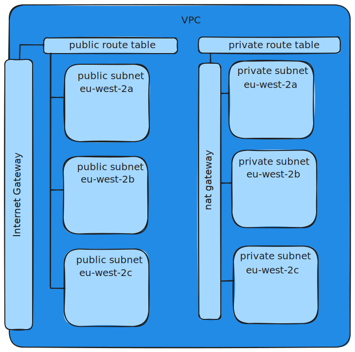

  

  <h1 align="center" style="color: #0074D9;">Team Tertius</h1>

### Full Stack Web App Project
This project implements a user authentication system comprising a login page, signup page, and a dashboard control panel. It utilizes Amazon Elastic Kubernetes Service (EKS) to host a React-based front-end application and a Java-based backend API. The backend API interacts with a PostgreSQL database, implimented in Amazon Relational Database Service (RDS) to manage user information securely.

## Table of Contents

1. [Amazon Web Services](#amazon-web-services)
2. [Database](#database)
3. [Front-end React App](#front-end-React-App)
4. [Back-end Java API](#back-end-Java-API)
5. [Endpoints](#endpoints)
6. [Authentication](#authentication)
7. [Deployment](#deployment)
8. [Folder Structure](#folder-structure)
9. [Troubleshooting](#troubleshooting)

# Amazon Web Services

### Components
- vpc
- subnet - public x3
- subnet - private x3
- route table - public
- route table - private
- internet gateway
- nat gateway

### Layout

### tfvars

End-user provides terraform.tfvars file with desired config

- region - region to deploy in
- vpc_name - naming vpc and in the naming convention for vpc components
- vpc_cidr - assigning a cidr block to the vpc
- public_subnets - creating public subnets each with a cidr block from the given list 
- private_subnets - creating private subnets each with a cidr block from the given list 
- availability_zones - assigning components to availability zones

### Tags

#### ManagedBy
Every component (where possible) is tagged with:

    ManagedBy = "Terraform"  

This is to reinforce at console management that the component should only be managed via terraform.

#### Name
Every component (where possible) is named with the prefix of the vpc_name variable  
e.g. "${vpc_name}-eu-west-2a-public-subnet

#### EKS
The public subnets are tagged with:

    "kubernetes.io/cluster/${var.cluster_name}" = "shared"
    "kubernetes.io/role/internal-elb"           = 1

The private subnets are tagged with:

    "kubernetes.io/cluster/${var.cluster_name}" = "shared"
    "kubernetes.io/role/elb"                    = 1

This is to indentify the placement of the elb & internal-elb for the EKS.  

### requirements

Terraform EKS module version: 19.15.2  
Terraform VPC module version: 5.0.0  
AWS EKS cluster_version = 1.27

[[ Back to top ]](#)

# Database

Backend postgres RDS database

### Requirements
- VPC
- subnet
- security group, to allow ingress on 5432

### Exposed endpoints

- health
- info 
- prometheus

### Terraform database module

variables
- db_name: defaults to "main"
- db_username: to create postgres RDS database user, don't use "user" or "admin" as they are reserved words in postgres
- db_password: to create postgres RDS database password, has minimum requirements
- db_subnets: list of subnets to create RDS database in, public / private, dedicated subnet?, availiability zone?
- az: availability zone for postgres database RDS
- db_security_group_ids - list of security groups for ingress to postgres database RDS on port 5432

outputs  
- db_dns_address - DNS address assigned when RDS database is created

### SQL commands Files

creates customer table

    CREATE TABLE customer (
        id SERIAL PRIMARY KEY,
        name TEXT NOT NULL,
        email TEXT NOT NULL,
        password TEXT NOT NULL,
        age INT NOT NULL
    );

adds unique constraint to profile_image_id, the id used to create unique customer images for each customer entry

    ALTER TABLE customer
    ADD COLUMN profile_image_id VARCHAR(36);

    ALTER TABLE customer
    ADD CONSTRAINT profile_image_id_unique UNIQUE (profile_image_id);

[[ Back to top ]](#)

# Front-end React App

App provides a front-end user authentication system comprising a login page, signup page, and a dashboard control.

### Build Enviroment

- node:20.10.0  
- nginx:1.21.0-alpine  

### Libraries, Frameworks, or Utilities

- ChakraUI
- Formik
- Yup
- Axios

### Enviromental Variables

.env enviromental variables file, located in the root of the repository
setting the variable VITE_API_BASE_URL, 

[[ Back to top ]](#)

# Back-end Java API

This API provides user login authentication and storage functionality using Java Spring Boot and PostgreSQL.

### Build Enviroment

- eclipse-temurin:17-jre-jammy
- maven:3-amazoncorretto-20  

### Configuration files

The backend java API uses yaml config files to connect to a database.  
currently this is a H2 in-memory database.  
this is a sample yaml config file for connecting to a postgres database.  
need to replace:
- URL: URL of postgres database
- USERNAME: username of database user, don't use "user" or "admin" as they are reserved words in postgres
- PASSWORD: password of database user

        server:
        port: 8080
        error:
            include-message: always

        cors:
        allowed-origins: "*"
        allowed-methods: "*"
        allowed-headers: "*"
        exposed-headers: "*"

        management:
        endpoints:
            web:
            exposure:
                include: "health,info,prometheus"

        spring:
        datasource:
            url: jdbc:postgresql://URL:5432/customer
            username: USERNAME
            password: PASSWORD
        jpa:
            hibernate:
            ddl-auto: validate
            properties:
            hibernate:
                dialect: org.hibernate.dialect.PostgreSQLDialect
                format_sql: true
            show-sql: false

[[ Back to top ]](#)

# Endpoints

increases COUNT by 1 and returns:  
'{ "result": "pong: COUNT" }'

    /ping

following endpoints require auth or return:  
"message": "Full authentication is required to access this resource"  
"statusCode": 403

POST auth username and password and receive jwtToken

    /api/v1/auth/login

POST new customer  

    /api/v1/customers

GET all customers

    /api/v1/customers

GET customer by id

    /api/v1/customers/:id

PUT update customer by id

    /api/v1/customers/:id

DELETE customer by id

    /api/v1/customers/:id

POST customer profile image

    /api/v1/customers/:id/profile-image

GET customer profile image

    /api/v1/customers/:id/profile-image

[[ Back to top ]](#)

# Authentication

### User Credentials

Alongside the input forms created using the JavaScript Formik library the schema builder "Yup" is used for for value parsing and validation of entered user credentials.

User credentials are then POSTed to the API endpoint: /api/v1/auth/login at the URL taken from the VITE_API_BASE_URL enviromental variable of the .env file.
    
### API Authentication

The API receives the user's credentials from the React App. It validates these credentials to verify the user's identity by checking against the database's customer table.

Upon successful validation, the API generates an authentication token in the form of a JSON Web Token.
This token is sent back to the React App as part of the response.

### React App Handling of Token

The React App then receives this token, decodes it and stores the username and user role in the browsers local storage. 

This token is then attached to every request requiring authentication, using the request headers:

    headers: {
        Authorization: `Bearer ${localStorage.getItem("access_token")}`
    }

### Handling Token Expiry

Upon creation the token is initialised with a expiration time of 15 days. When the React App routes through a protected route the token and its expiry is checked, if expired the user is automatically logged out.

### Logging Out

When the user logs out from the React App, the locally stored token is removed.

[[ Back to top ]](#)

# Deployment
getting started 
- prereqs, software or acc
- deployment instructions
- useage

[[ Back to top ]](#)

# Folder Structure

CE-TEAM-PROJECT/  
├── Kubernetes/  
│   ├── deployment.yaml  
│   └── service.yaml  
├── Terraform/  
│   ├── modules/  
│   │   ├── Network/  
│   │   ├── EKS/  
│   │   ├── Security/  
│   │   └── Database/  
│   ├── main.tf  
│   ├── outputs.tf  
│   └── providers.tf  
├── Media/Images  
│   ├── logo.svg  
│   └── network_layout.svg  
└── Documentation/  
    └── README.md  

# Troubleshooting

Troubleshooting: Anticipate common issues and provide solutions or links to relevant troubleshooting resources.

[[ Back to top ]](#)